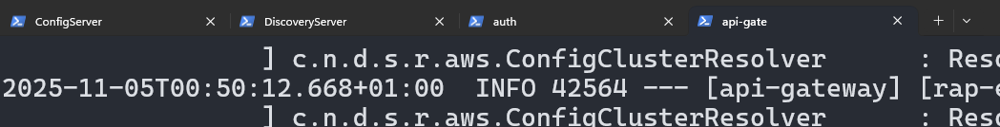
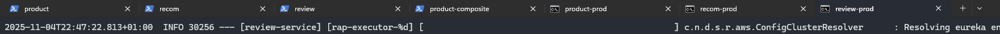
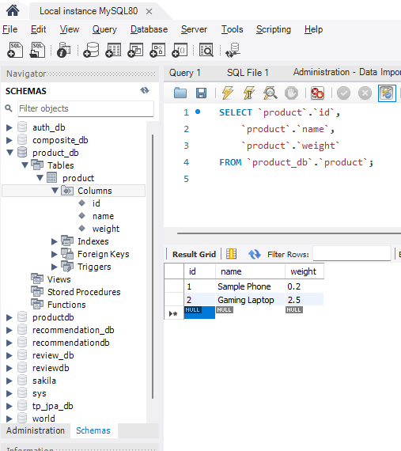

# Microservices Project – All-in-One Guide

This document consolidates everything we set up and verified across the microservices system: service discovery, configuration management, API Gateway routing and auth, load balancer logging, circuit breakers and fallbacks, metrics, tracing, and practical test steps. It also reserves spots for screenshots to illustrate the running system.

## Table of Contents
- Architecture Overview
- How to Run (Dev and Prod)
- Service Discovery (Eureka)
- Configuration Server (Git-backed)
- API Gateway (Routes, Auth Filter, Load Balancer Logs)
- Product Composite (Circuit Breaker + Fallback)
- Metrics and Instrumentation
- Distributed Tracing (Zipkin)
- REST Client Helper
- Verification Steps and Troubleshooting
- Screenshots (Placeholders)

## Architecture Overview
- Services
  - `discovery-server` (Eureka): `8761`
  - `config-server`: `8888` (serves configs from `github-config-repo`)
  - `api-gateway`: `8085`
  - `authorization-service`: `8084`
  - `product-service`: `8081`
  - `review-service`: `8082`
  - `recommendation-service`: `8083`
  - `product-composite-service`: `8086`
- Production profile (via Config Server)
  - `product-composite-service`: `9080`
  - `product-service`: `9081`
  - `review-service`: `9082`
  - `recommendation-service`: `9083`
  - `authorization-service`: `9090`
- Observability
  - Actuator exposed: `health`, `info`, `metrics` (and `mappings` in composite service)
  - Zipkin: `9411` (configured with Brave, B3 propagation, sampling 1.0)

## How to Run (Dev)
1. Start Config Server:
   - `config-server\config-server> mvnw.cmd spring-boot:run`
2. Start Discovery Server:
   - `discovery-server\discovery-server> mvnw.cmd spring-boot:run`
3. Start services:
   - `api-gateway\api-gateway> mvnw.cmd spring-boot:run`
   - `authorization-service\authorization-service> mvnw.cmd spring-boot:run`
   - `product-service\product-service> mvnw.cmd spring-boot:run`
   - `review-service\review-service> mvnw.cmd spring-boot:run`
   - `recommendation-service\recommendation-service> mvnw.cmd spring-boot:run`
   - `product-composite-service\product-composite-service> mvnw.cmd spring-boot:run`
4. Optional: Zipkin server on `9411` for traces.

## How to Run (Prod profile)
- Use `--spring.profiles.active=prod` when starting a service to apply the `*‑prod.properties` from `github-config-repo`.
- Example:
  - `product-composite-service> mvnw.cmd spring-boot:run -Dspring-boot.run.arguments=--spring.profiles.active=prod`
  - Then call `http://localhost:9080/product-composite/1`.

## Service Discovery (Eureka)
- Access dashboard: `http://localhost:8761`
- All services register here, enabling dynamic routing via the Gateway.
- Expect to see `API-GATEWAY`, `AUTHORIZATION-SERVICE`, `PRODUCT-SERVICE`, `REVIEW-SERVICE`, `RECOMMENDATION-SERVICE`, `PRODUCT-COMPOSITE-SERVICE` marked `UP`.

## Configuration Server (Git-backed)
- Server pulls properties from `github-config-repo`.
- Common patterns:
  - `spring.config.import=optional:configserver:` in local apps
  - `spring.cloud.config.uri=http://localhost:8888`
- Quick check:
  - `GET http://localhost:8888/<service>/default` or `/prod` to verify served configs
  - Look for `app.config.source=github` (or `github-prod`) in actuator `/env` output

## API Gateway (Routes, Auth, Load Balancer)
- Static routes (`application.yml`):
  - `/product-composite/** -> lb://product-composite-service`
  - `/products -> lb://product-service` (explicit base path route)
  - `/products/** -> lb://product-service`
  - `/reviews/** -> lb://review-service`
  - `/recommendations/** -> lb://recommendation-service`
- Discovery locator: `spring.cloud.gateway.discovery.locator.enabled=true`
- Authorization Filter enhancements:
  - Skips `/actuator/**` and `OPTIONS` requests
  - Validates credentials via `authorization-service` (`POST /auth/validate`)
  - On auth service failure: returns `401 UNAUTHORIZED` gracefully
- Required headers for non-actuator calls:
  - `username: user|admin`, `password: user|admin`, `role: user|admin`
- Load balancer logging filter:
  - Logs chosen downstream host and port after load balancing
  - Logging level for `com.example.api_gateway.filter` set to `INFO`

## Product Composite (Circuit Breaker + Fallback)
- Endpoint: `GET /product-composite/{productId}`
- Resilience4j CircuitBreaker named `composite`
  - `slidingWindowSize=10`, `failureRateThreshold=50%`, `waitDurationInOpenState=10s`, etc.
  - Health indicator registered; exposed via Actuator
- Fallback behavior:
  - Returns minimal `ProductAggregate` with `product.name="Unavailable"` and empty lists when downstream failures occur.
- Actuator `mappings` enabled to verify handler registration.

## Metrics and Instrumentation
- Counters in composite service:
  - `product_composite.requests.get`
  - `product_composite.requests.write`
- Verify via Actuator:
  - `GET /actuator/metrics/product_composite.requests.get`
  - `GET /actuator/metrics/product_composite.requests.write`

## Distributed Tracing (Zipkin)
- Sampling: `management.tracing.sampling.probability=1.0`
- Propagation: `B3`
- Zipkin endpoint: `http://localhost:9411`

- Expect traces for Gateway, product/review/recommendation calls, and auth validation.

## REST Client Helper
- `rest-client` app exposes `GET /client/product-composite/{id}`
- Uses `client.gatewayBaseUrl` (default `http://localhost:8085`) and optional auth headers to call through Gateway.

## Verification Steps
- Gateway routes:
  - `GET http://localhost:8085/products` with auth headers
  - `GET http://localhost:8085/product-composite/1` with auth headers
- Direct services:
  - `GET http://localhost:8081/products`
  - `GET http://localhost:8082/reviews?productId=1`
  - `GET http://localhost:8083/recommendations?productId=1`
  - `GET http://localhost:8086/product-composite/1` (or `9080` in prod)
- Circuit breaker:
  - Stop one downstream service to trigger fallback
  - Call composite and confirm `Unavailable` payload
- Load balancer:
  - Start a second `product-service` instance (e.g., `--server.port=9081`)
  - Call `/products` via Gateway repeatedly and observe forwarded host:port logs

## Troubleshooting
- 404s:
  - Wrong port/profile (dev `8086` vs prod `9080`)
  - Missing explicit route for `/products` root (fixed)
- 401s:
  - Missing required headers for Gateway auth
  - Incorrect `role` (`user` or `admin`) or credentials
- Actuator not exposed:
  - Ensure `management.endpoints.web.exposure.include=health,info,metrics` (and `mappings` in composite)
- Config not loading:
  - Check `http://localhost:8888/<service>/default`
  - Verify `spring.config.import=optional:configserver:`

## Screenshots (Placeholders)
- Eureka dashboard: `docs/images/eureka-dashboard.png`
- Zipkin traces view: `docs/images/zipkin-traces.png`
- Gateway forwarded host:port logs: `docs/images/gateway-forwarded-port.png`

Place your images in the `docs/images/` folder with these filenames. The README will render them automatically if present:

---

References
- `README-config-server.md`: Config Server usage and checks
- `README-load-balancer.md` / `README-test-load-balancer.md`: verifying load balancing and logs
- `README-circuit-breaker.md`: steps to drive CB through Closed/Open/Half-Open
- `README-metrics.md`: composite counters and validation
- `README-rest-client.md`: gateway calling helper
